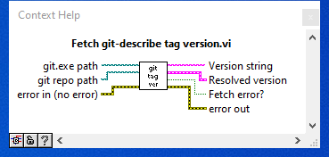

# LV-git-describe-version

中文介紹：[在 LabVIEW UI 中加入 git 的版本號](https://show6114.com/2018/12/26/lv-git-describe-version/)

# Intro

The main VI `Fetch git-describe tag version.vi` fetch the git based version code with the Windows _Command Prompt_ of `git describe --tages` command from specified repository/folder.



To make it works, users must done the following actions:

1. Have git version control in your LabVIEW project/programming folder
2. Add at least one annotated or non-annotated `tag` into your git repository

The git based version code is output at the following format (below is an example):

```bash
v1.0.4-14-g2f14721
```

The `v1.0.4` indicates the most recent git tag at current repository. The `14` describes the number of additional commits since the latest git tag. The hex number `2f14721` with leading `g` is the abbreviated hash (7 character git hash) of the most recently commit .

If there are no tags in the git repository, the VI `Fetch git abbreviated hash.vi` is also provided to fetch the abbreviated hash by using `git branch -v` command.


In short, if there...

* _are_ tags in the repository, use `Fetch git-describe tag version.vi` to fetch the complete version code.
* are _NO_ tags in the repository, use `Fetch git abbreviated hash.vi` to fetch only the abbreviated hash instead.

## Environment

Any distribution of LabVIEW 2016. No add-ons or modules required.

## Functional VI hierarchy

Two top level VIs and two supporting VIs:

* `Fetch git-describe tag version.vi`
  * `CMD git describe --tags.vi`
* `Fetch git abbreviated hash.vi`
  * `CMD git branch -v.vi`

## Example

Check the `Example of fetch current git version code.vi` and `Example of fetch git 7-digi hash somewhere.vi` for the demonstration.

## Notice

When building VI into EXE file, `Fetch git version code.vi` and `Fetch git abbreviated hash.vi` can not fetch the git version code anymore (it is typically no need for git version control at EXE contained folder). It is recommended to run and save the git version code at development stage, and load the version code at LabVIEW run time mode by _Conditional Disable Structure_ with `RUN_TIME_ENGINE` set to `TRUE`.

## Trouble shooting

### No git tag found

Error:

> fatal: No names found, cannot describe anything.

Solve:

Use `git tag` command to add tag into your repository. Or checkout into branches with git tag available. Or just fetch the abbreviated hash instead.

### Not a git repository

Error:

> fatal: not a git repository (or any of the parent directories): .git

Solve:

Correct the git repository path to the folder with git person controlled . Or initialize a git repository with `git init` command at specified LabVIEW project/programming folder.
